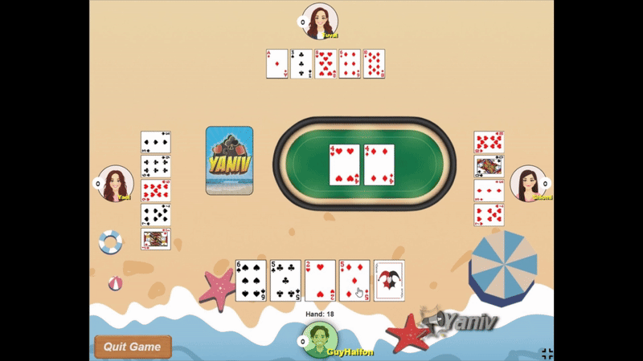
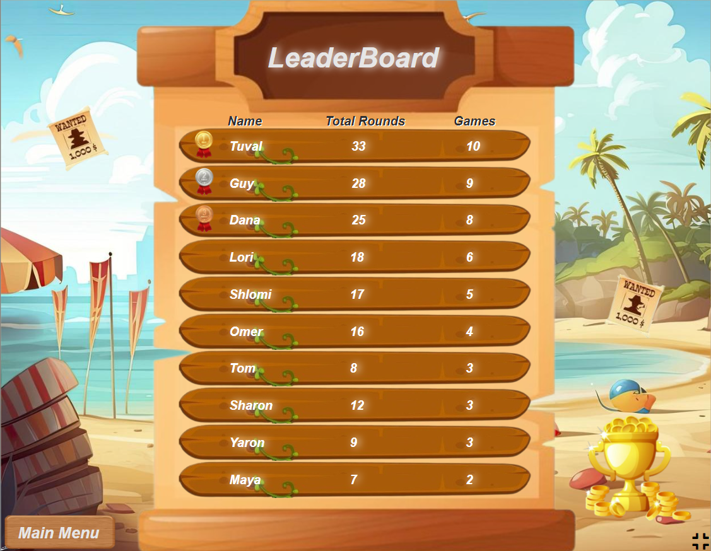

Link - https://yaniv-project.onrender.com/

Project "Yaniv" - Card Game

What is "Yaniv" Game?
"Yaniv" is an enjoyable card game based on the original version of the popular card game. It involves strategy, luck, and quick thinking. The goal of the game is to minimize the points in your hand by collecting sets of cards and declaring "Yaniv" when you think you have the lowest total points.

Game Rules:
Objective: The objective of the game is to minimize the points in your hand by forming sets of cards.

Dealing: Each player is dealt a hand of cards from a standard deck of 52 cards.

Gameplay: Players take turns to either draw a card from the deck or pick up the top card from the discard pile. They then must discard a card from their hand.

Sets: Players can form sets of cards, such as three of a kind or a straight (sequence of cards in the same suit). Sets are used to reduce the total points in the player's hand.

Yaniv: A player can declare "Yaniv" on their turn if they believe they have the lowest total points in their hand. To declare "Yaniv," a player's total points must be equal to or less than the current minimum threshold (usually 7 or 5). Once "Yaniv" is declared, other players have one more turn to try and lower their own total points.

Assaf: If a player declares "Yaniv" but is found to have the highest total points in their hand, they are "Assafed" and receive a penalty equal to the value of their hand.

Scoring: At the end of each round, players reveal their hands, and points are tallied based on the value of the cards remaining in each player's hand. The player with the lowest total points wins the round.

Functional Programming Approach:
The "Yaniv" game project is developed with a focus on functional programming principles. Functional programming emphasizes the use of pure functions, immutability, and higher-order functions to create clean, modular, and maintainable code.

Components:
1. Game Engine:
Responsible for managing the game state, including dealing cards, player turns, and scoring.

2. User Interface:
Provides the visual representation of the game, allowing players to interact with the game engine. Implemented using HTML, CSS, and JavaScript.

3. Leaderboard Component:
Manages the storage and display of player scores using MongoDB. Allows players to view their past performance and compare scores with other players.

Technologies Used:
HTML
CSS
JavaScript
Node.js
MongoDB

Leaderboard:
The leaderboard is stored in a MongoDB database. Players' scores are recorded and displayed on the leaderboard.
